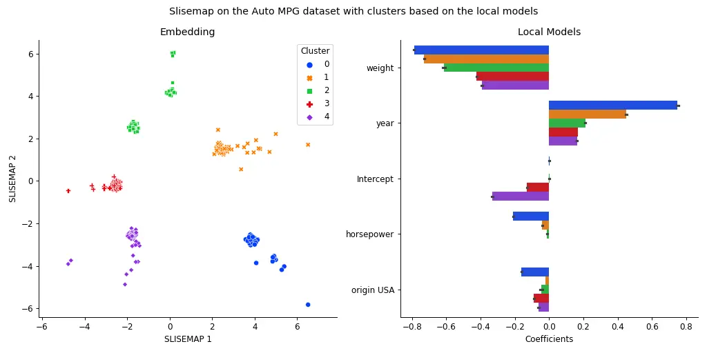

[](https://pypi.org/project/slisemap/)
[](https://edahelsinki.github.io/slisemap/slisemap/)
[](https://github.com/edahelsinki/slisemap/actions/workflows/python-pytest.yml)
[](https://github.com/edahelsinki/slisemap/blob/master/LICENSE)
[](https://mybinder.org/v2/gh/edahelsinki/slisemap/HEAD?labpath=examples)

# SLISEMAP: Combine supervised dimensionality reduction with local explanations

SLISEMAP is a supervised dimensionality reduction method, that takes data, in the form of vectors, and predictions from a *black box* regression or classification model as input. SLISEMAP then simultaneously finds local explanations for all data items and builds a (typically) two-dimensional global visualisation of the black box model such that data items with similar local explanations are projected nearby. The explanations consists of *white box* models that locally approximate the *black box* model.

SLISEMAP is implemented in *Python* using *PyTorch* for efficient optimisation, and optional GPU-acceleration. For more information see the [full paper](https://arxiv.org/abs/2201.04455), the [demo paper](https://github.com/edahelsinki/slisemap/blob/main/examples/demo_paper.pdf), the [demonstration video](https://youtu.be/zvcFYItwRlQ) ([slides](https://github.com/edahelsinki/slisemap/blob/main/examples/slisemap_demo_paper.pptx)), the [examples](https://github.com/edahelsinki/slisemap/tree/main/examples), or the [documentation](https://edahelsinki.github.io/slisemap/slisemap).


## Citation

> *Björklund, A., Mäkelä, J. & Puolamäki, K. (2022).*  
> **SLISEMAP: Supervised dimensionality reduction through local explanations**.  
> arXiv:2201.04455 [cs], [https://arxiv.org/abs/2201.04455](https://arxiv.org/abs/2201.04455).  


## Installation

To install the package just run:

```sh
pip install slisemap
```

Or install the latest version directly from [GitHub](https://github.com/edahelsinki/slisemap):

```sh
pip install git+https://github.com/edahelsinki/slisemap
```

### PyTorch

Since SLISEMAP utilises PyTorch for efficient calculations, you might want to install a version that is optimised for your hardware. See [https://pytorch.org/get-started/locally](https://pytorch.org/get-started/locally/) for details.


## Example

```python
import numpy as np
from slisemap import Slisemap

X = np.array(...)
y = np.array(...)
sm = Slisemap(X, y, radius=3.5, lasso=0.01)
sm.optimise()
sm.plot(clusters=5, bars=5)
```


See the [examples](https://github.com/edahelsinki/slisemap/tree/main/examples) for more detailed examples, and the [documentation](https://edahelsinki.github.io/slisemap/slisemap.html) for more detailed instructions.
