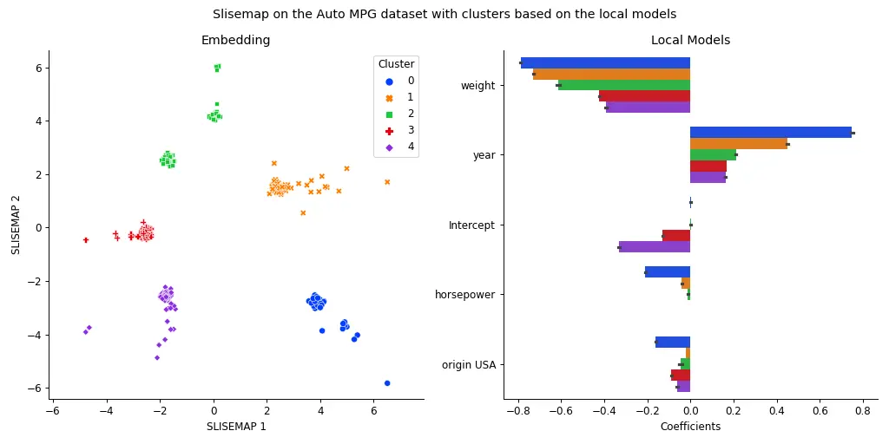

# SLISEMAP: Combining supervised dimensionality reduction with local explanations

SLISEMAP is a supervised dimensionality reduction method, that takes data, in the form of vectors, and predictions from a *black box* regression or classification model as input. SLISEMAP then simultaneously finds local explanations for all data items and builds a (typically) two-dimensional global visualisation of the black box model such that data items with similar local explanations are projected nearby. The explanations consists of *white box* models that locally approximate the *black box* model.

SLISEMAP is implemented in *Python* using *PyTorch* for efficient optimisation, and optional GPU-acceleration. For more information see the [full paper](https://arxiv.org/abs/2201.04455), the [demo paper](examples/demo_paper.pdf), the [demonstration video](https://unitube.it.helsinki.fi/unitube/embed.html?id=512aec75-1ee3-4815-b78e-53f952d48880), or the [examples directory](https://github.com/edahelsinki/slisemap/tree/master/examples).


## Citation

> *Björklund, A., Mäkelä, J. & Puolamäki, K. (2022).*  
> **SLISEMAP: Supervised dimensionality reduction through local explanations**.  
> arXiv:2201.04455 [cs], https://arxiv.org/abs/2201.04455.  


## Installation

To install the package just run:

```sh
pip install slisemap
```

Or install the latest version directly from GitHub:

```sh
pip install git+https://github.com/edahelsinki/slisemap
```

### PyTorch

Since SLISEMAP utilises PyTorch for efficient calculations, you might want to install a version that is optimised for your hardware. See https://pytorch.org/get-started/locally/ for details.


## Example



See the [examples directory](https://github.com/edahelsinki/slisemap/tree/master/examples) for instructions and more detailed examples.
